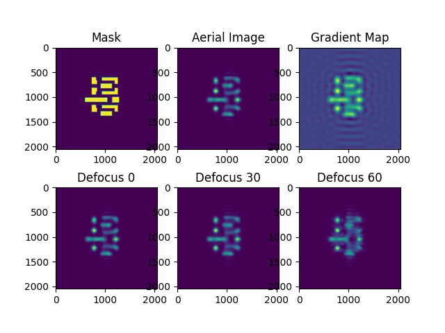

# TorchLitho 2.0: Ultrafast Differentiable Lithography Simulation Engine

TorchLitho 2.0 is a lightweight and user-friendly lithography simulation engine designed for full-chip scale mask optimization.
It includes two optical models, Abbe and Hopkins, with results that are well-aligned.
The engine is developed using PyTorch and features self-defined gradient calculations for improved efficiency.

## Install
To set up the project, follow these steps:

1. **Install the required dependencies**
Ensure that the requirements.txt file is in the current directory, then run the following command:
```sh
pip install -r requirements.txt
```
2. **Install the TorchLitho 2.0 project**
Run the following command to install the project:

```sh
pip install .
```
## Litho Simulation

The following table lists the parameters that can be configured.

| Param      | Type      | Description                                                                                               | Default |
|------------|-----------|-----------------------------------------------------------------------------------------------------------|---------|
| Pixel      | int       | Pixel count per side of the mask/image grid (unit: pixels). Sets the discrete resolution of the simulation. | 14      |
| Sigma      | float     | Source broadening parameter σ. For partially coherent illumination: NA-normalized source extent (unitless). If used as a Gaussian PSF/filter std, specify units (e.g., pixels). | 0.05    |
| NA         | float     | Numerical Aperture (unitless). Determines cutoff spatial frequency and resolution.                         | 1.35    |
| Wavelength | int       | Illumination wavelength (unit: nm). 193 nm corresponds to an ArF source.                                   | 193     |
| Defocus    | List[int] | List of defocus values (unit: nm; consider standardizing to nm). Sign convention depends on your model’s coordinate system. | None    |
| Par        | bool      | Enable parallel mode for Abbe imaging/convolution simulation (performance only; no physical change).       | False   |
| Batch      | bool      | Enable a batch dimension to simulate multiple masks/fields at once (inputs must include a batch axis).     | False   |

## Example
The example shows the simulation results of the ICCAD13 benchmark using a canvas size of $2048 \times 2048$ and a pixel size of 1.



